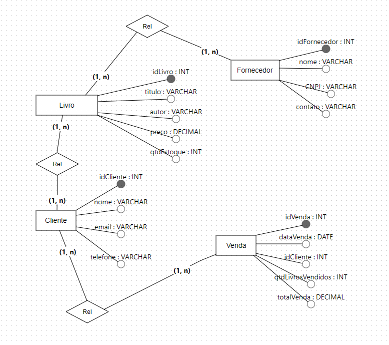
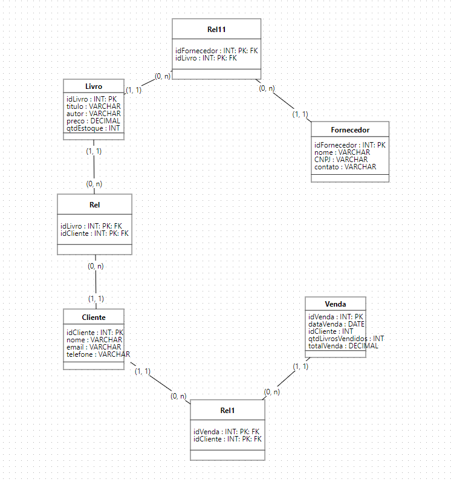
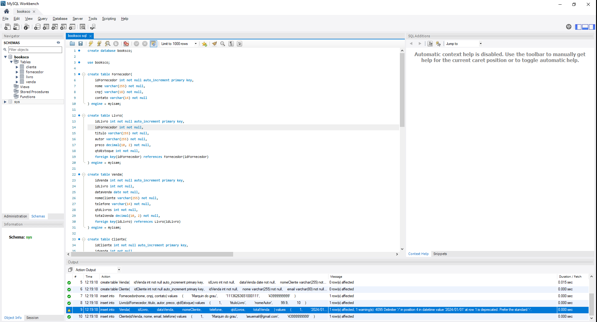

# Livraria Books&Co
A livraria "Books&Co" opera com um banco de dados relacional que suporta as operações essenciais de um sistema de gerenciamento, incluindo controle de estoque, administração de vendas, gestão de clientes e fornecedores.

Acesse os documentos na pasta > docs

# Modelagem do banco de dados:
Modelos implementados no banco de dados.

### Modelo conceitual:

### Modelo lógico:

### Código VSCode:

### Código MySQL Workbench:

# by: Marcos Junior "H0wZy" Bueno Selzler.

